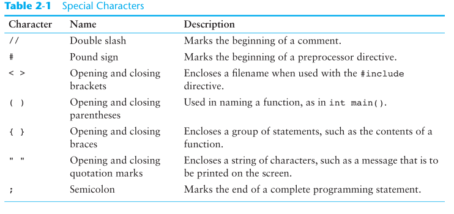
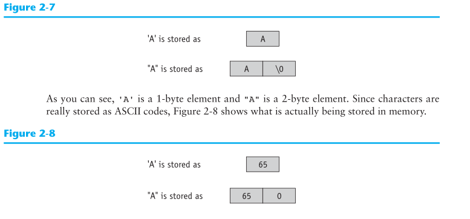

# Gaddis CH2
# The Parts of a C++ Program
- `namespaces`:
  - Variables, functions, and objects are examples of program entries that must have names. 
  - C++ uses `namespaces` to organize the names 
  - E.g.: 
    - `namespace std;`
    - declares the program will be accessing entities whose names are part of the ( `std` ) `namespace`
    - Why is this one required: 
      - every name created by the HEADER FILE `iostream` ( which allows input from keyboard and output to screen) is part of the `std namespace`.

- `#include <iostream\>`: 
  - The # tells the program where to start looking 
  - include tells the progam to include a file 
  - iostream is a header file that allows input by keyboard and output by screen

- `using namespace std`: 
  - tells the program to use the std namespace (a name organization system) where std specifically allows access to iostream created names. (user created)

- `int main()`: 
  - Most programs have  more than one function but all programs need a program called `main`. 
  - int: 
    - sends an integer to the OS when it is finished executing 
    - `main` is the name of the created function

# The `cout` Object
 - aka "Console output" 
 - is a `stream object`
   - this means it works with streams of data
   - E.g.: 
     - To print a message on a screen you need to send a stream of characters to `cout`
     -` cout << "Hello"; `
       - `<<`: sends the data "Hello" to the object cout which sends it to the user on the screen
       - When << is used this way it is called a `stream-insertion operator`

# Header Files
- In older styles of C++ header files end with `.h`
- Therefore the following was used 
  - `#include <iostream.h\>`
- Older style also did not type the namespace statement or support them
- Older style also did not return an int
  - instead they had: 
    - `void main()` or `void main(void)`
    - indicating the program would not return anything 

# Identifiers
-  represents some element of a program 
  - E.g.: 
    - Variable names: `number = 7`
    - any name can be used/created by the user so long as it is not a C++ key word

# Integer Data Types 
- 6 different data types 
- storing 2 or 4 bytes of memory 
- Recall: 
  - 1 byte: has 8 bits 
  - 2 bytes: 16 bits --> allowing $2^{16}$ bit patterns of binary 
- Types: 
  - `short` = 2 bytes with negatives 
  - `unsigned short` = 2 bytes 0 to 65,535
  - `int` = 4 bytes with negatives 
  - `usigned int` = 4 bytes 
  - `long` = int 
  - `unsigned long` = unsigned int
- E.g.g: 
  - `unsigned int days;` // these two definitions 
  - `unsigned days;`  // are equivalent

# Floating-Point Data Types
- 3 Types of representations (all include negatives)
- Computers use E notation to represent floating-point values 
- E.g.: 
  - Storing the number $3,456$ = $3.456 \cdot 10^{3}$
  - The `mantissa` = 3.456 is stored as a floating point 
  - The mantissa is then multiplied by a power of 10 i.e. $10^3$
- Types: {exact sizes depend on the system}
  - `float` = 4 bytes :  single precision 
    - 7 sigfigs
  - `double` = 8 bytes :  twice as large - double precision
    - 16 sigfigs
  - `long double` = 8 bytes* : obvi - larger than double 
    - at least 16 sigfigs

# Floating-Point Constants
- Warning messages from compilers: 
  - `num = 14.725;` // Might give Error
  - `num = 14.725f;` // Should allow storing
  - `num = 14.725L;` // if needs more memory 

# Assigning Floating-Point Values to Integer Variables 
- E.g.: 
  - `int number;`
  - `number = 7.8;`  // Assigns 7 to the number not 7.8 
  - This is TRUNCATION 

# The `char` Data Type
- Characters are sorted with ASCII Codes
  - American Standard Code for Info Interchange
- `char` data types holds only a single character
  - Holds one byte of memory
- Recall: 
  - Two basic data types: 
    - Numeric 
    - Character

# Character and String Literals

- `' '` != `" "`

# The C++ `string` Class
- `char` can only hold one byte so we extend for strings
- `string class`: 
  - allows the programmer to create a string type variable 

# Using the `string` Class
- This is done with a preprocessor derective
- Pulling the file <`string`>
- From this we can define `string object`
  - E.g.: `movieTitle = "Balls of Fury";`
  - Similar to Numerics  

# The `bool` Data Type
- `true` = 1 
- `false` = 0
- E.g.: 
  - ... `int main()` {
  - `bool boolValue = true;`
  - `cout << boolValue << endl;` ...  }

# Determining the Size of a Data Type 
- `sizeof` operator 
  - used to determine the size of a data type on any system

# More on Variable Assignments and Initialization 
- assignment operation: 
  - assigns/copies a value onto a variable 
  - "=" is the assignment operator
- initialization: 
  - value is assigned to a variable as part of the variable's definition 

# Scope 
- A variable's scope is the part of the program that has access to the variable
- every variable has scope 
  - scope is the part of the program where the variable can be used 
- Rules to Scope: 
  1. A variable cannot be used in any part of the program before it is defined
  