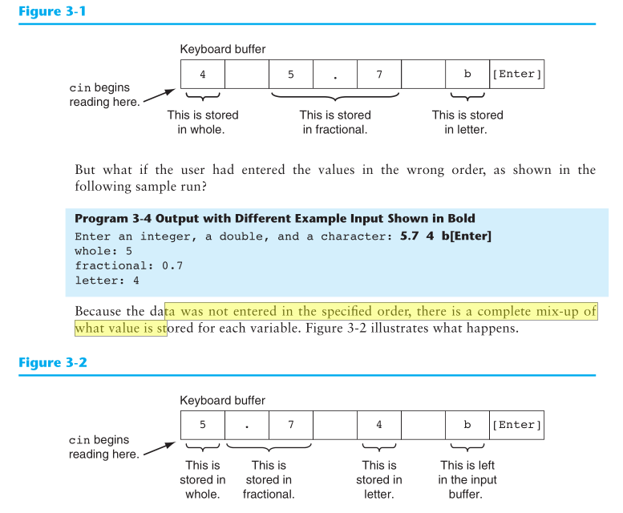

# Gaddis CH3
# Epressions and Interactivity 
# The `cin` Object 

- `>>`: Stream extraction operator

# No Exponents Please!
- HEADER FILE: <`cmath`>
- C++ does not have an exponent operator 
- Use `library function`: 
  - `pow(a,b)`:
    - Where `a` is raised to `b` i.e $a^b$
    - a & b are arguments 

# Data Type Conversion and Type Casting 
